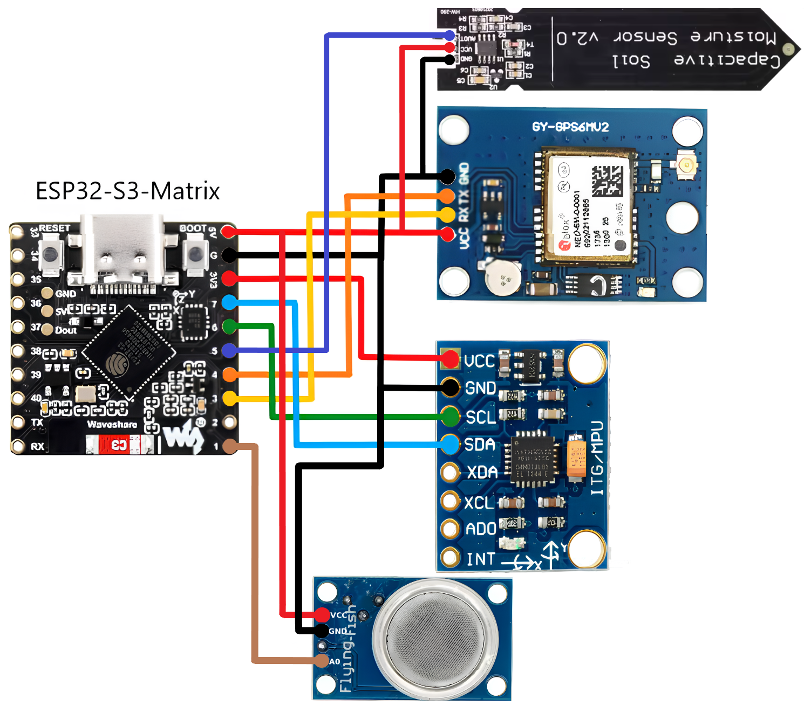

  

# ESP-NOW MeteoStation_v1.2

Версія 1.2 (з певними змінами) моєї DIY метеостанції на базі **ESP32-S3** та **ESP32-WROOM-32** з використанням **ESP-NOW** для бездротової передачі даних.

---

## 🔄 Оновлення 
- Додано TFT дисплей  
- Додано вимірювання вологості ґрунту  
- Додано датчик для вимірювання концентрації зрідженого газу (пропану та бутану), чадного газу та диму (горючих частинок та інших газів)  
- Змінений інтерфейс пристрою  

---

## ⚙ Технічні деталі
- **MCU:** ESP32-S3 та ESP32-WROOM-32  
- **Дисплей:** TFT Display 1.8  
- **GPS:** модуль з підтримкою TinyGPS++  
- **Датчики:**  
  - MPU6050 (поки що використовується лише як температурний сенсор, у майбутньому буде замінений)  
  - MQ-2 (вимірює концентрацію зрідженого газу, чадного газу та диму)  
  - Capacitive Soil Moisture Sensor (вимірює вологість ґрунту)  
- **Протокол:** ESP-NOW  

---

## 📚 Використані бібліотеки
- Adafruit Unified Sensor  
- Adafruit MPU6050  
- TinyGPS++  
- TFT_eSPI  
- MQGasKit  

---

## 🔌 Схеми підключення

Тут зібрані усі електричні та принципові схеми для проєкту **ESP-NOW Weather Station v1.2**.

---

### 1. Схема підключення ESP32-S3 + GPS + MPU6050 + MQ-2 + Capacitive Soil Moisture Sensor

  
*Особиста розробка, виконана у графічному редакторі.*  

---

### 2. Схема ESP32 + TFT Display 1.8 + Джойстик

  

*Особиста розробка, виконана у графічному редакторі.*    

---

### 3. Таблиця розпіновка для ESP32-S3 + GPS + MPU6050 + MQ-2 + Capacitive Soil Moisture Sensor

  

---

© 2025 Vlad Bovsunivskij
